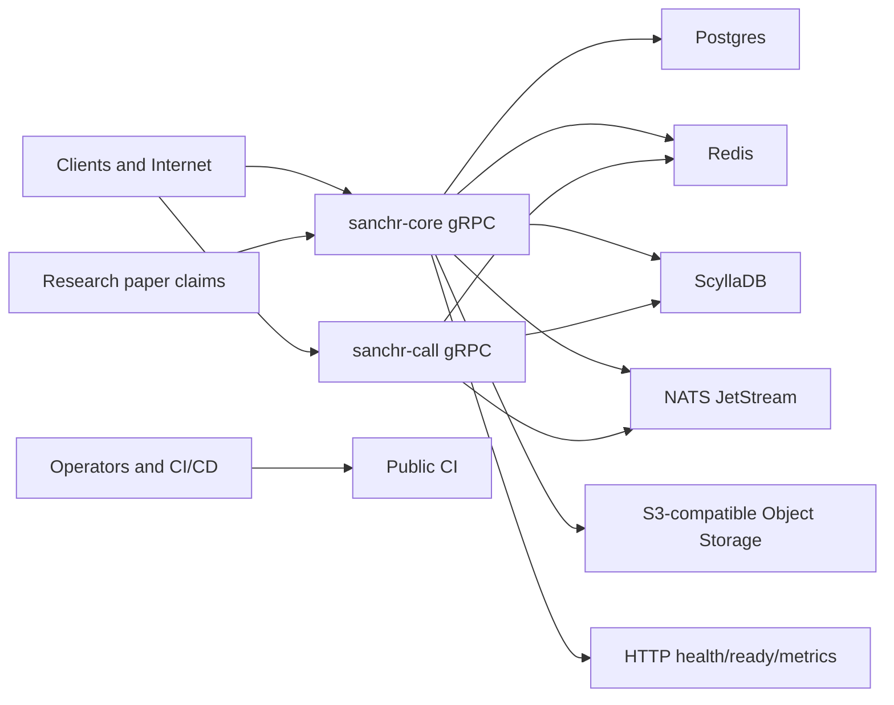

# Sanchr Backend Threat Model and Open Source Readiness

Date: 2026-04-11
Last updated: 2026-04-16

Scope: `backend/**`, with `web/public/research.pdf` used as an input for security claims and expected properties.

## Executive summary

No P0 findings remain. The remaining open items are P1 (KMS key provisioning) and P2 (operational hardening).

The highest-priority items are:

1. OPRF server secret and sealed-sender signer use ephemeral dev keys when not explicitly configured; KMS integration is stubbed but not complete.
2. NATS subject-level ACLs and per-service credentials are not enforced by the repository — they remain operator responsibilities.
3. Application-layer relay envelope signing is not implemented.
4. The code still uses legacy `sanchr` naming across crates, proto packages, and binaries. The full rename remains a separate compatibility-sensitive project.
5. Abuse detection (PoW challenge) is implemented but disabled by default (`challenge.enabled = false`).

Recommended release posture:

- The repository is suitable for open source release with the current security posture.
- Production deployment should use operator-managed secrets, NATS ACLs, and KMS-backed signing keys.
- Do not make public claims that all paper defenses are production-enforced until OPRF/sealed-sender keys are KMS-backed and abuse detection is enabled.

## Scope and assumptions

In scope:

- Rust backend workspace in this repository.
- Runtime services: `sanchr-core`, `sanchr-call`, `sanchr-db`, `sanchr-proto`, `sanchr-psi`, `sanchr-server-crypto`, and `sanchr-common`.
- Backend source and public CI/CD files under `.github` and the Rust workspace.
- Open source readiness: naming, policies, license posture, private CD separation, repo metadata, and release hygiene.
- Research-paper alignment using `/Users/soorajpandey/Projects/zynclave/sanchr/web/public/research.pdf`.

Out of scope:

- Client-side iOS/Android/Web implementation.
- Production cloud account configuration not represented in the repo.
- Dynamic penetration testing against a running deployment.
- Cryptographic proof review of OPRF, Signal-style messaging, or EKF constructions beyond repository integration review.

Validated assumptions from the project owner:

- The backend is currently in dev/testing, not production.
- GitHub CD will remain in a private repository.
- The public project name should be `sanchr`, not `sanchr`.

Security posture assumptions:

- The public internet can reach gRPC ingress endpoints.
- Any authenticated account may be malicious.
- A compromised pod or internal service may be able to publish to NATS unless auth/ACLs are added.
- Database, Redis, Scylla, S3, and NATS credentials are high-value secrets.
- The research paper creates user-facing expectations that time-bounded privacy controls are implemented and enforced.

## System model

### Primary components

- `sanchr-core`: primary gRPC and HTTP process (`crates/sanchr-core/src/main.rs`). It exposes auth, keys, messaging, contacts, settings, vault, media, backup, notification, and discovery services. It also exposes `/health`, `/ready`, and `/metrics` over HTTP (`crates/sanchr-core/src/server.rs:45`).
- `sanchr-call`: call signaling service using JWT auth, Redis active-call state, Scylla call logs, and NATS call subjects (`crates/sanchr-call/src/signaling.rs`).
- `sanchr-db`: Postgres migrations and repository functions, Redis helpers, Scylla table creation and data access.
- `sanchr-proto`: public API surface. Proto packages still use `sanchr.*`, such as `sanchr.auth` and `sanchr.messaging`.
- `sanchr-psi`: OPRF/PSI helper code used for private discovery.
- `sanchr-server-crypto`: JWT, password hashing, OTP, media key, TURN credential, and sealed sender crypto helpers.
- Data stores: Postgres, Redis, ScyllaDB, NATS JetStream, and S3-compatible object storage.
- Public repository contents: Rust services, docker-compose for local dependencies, load tests, and GitHub Actions under `.github/workflows`.

### Data flows and trust boundaries

1. Client to `sanchr-core` gRPC:
   - Unauthenticated entry points: registration, login, OTP verification, and similar auth bootstrap operations.
   - Authenticated entry points: messages, keys, contacts, settings, media, vault, backup, notification, and discovery.
   - Trust boundary: internet/client input crosses into privileged backend state.

2. Client to `sanchr-call` gRPC:
   - Authenticated call initiation, signaling stream, call end, history, and TURN credential minting.
   - Trust boundary: real-time streaming client input crosses into Redis, Scylla, and NATS.

3. `sanchr-core` HTTP:
   - `/health`, `/ready`, and `/metrics` are unauthenticated routes in the Axum router.
   - Trust boundary: operational metadata may cross from private infra to callers depending on ingress exposure.

4. `sanchr-core` and `sanchr-call` to Postgres:
   - Stores accounts, devices, keys, contacts, settings, media metadata, backup metadata, and refresh token hashes.

5. Services to Redis:
   - Stores sessions, rate-limit counters, OTPs, presence, idempotency keys, pre-key counters, and delivery tokens.

6. Services to Scylla:
   - Stores message outbox, sealed outbox, receipts, pending messages, vault items, reactions, and call logs.

7. Services to NATS:
   - Transports call events and message relay events.
   - Broker authentication and ACLs are operator-managed and not enforced by this repository.

8. `sanchr-core` to S3-compatible storage:
   - Issues presigned upload/download URLs for media and backups.
   - Stores encrypted blobs while the server owns metadata and access decisions.

9. Private CI/CD to cloud infrastructure:
   - Production image publishing, production Helm values, cloud credentials, and cluster deploys belong in a private operations repository.
   - Public CI should remain limited to secretless build, lint, and test jobs.

#### Diagram

## Assets and security objectives

Primary assets:

- User identities, phone numbers, device identifiers, and account recovery material.
- Refresh tokens, access-token sessions, OTPs, JWT signing secret, and password hashes.
- Social graph data: contacts, contact discovery responses, registered-user membership, blocks, presence, and profile metadata.
- End-to-end encryption key material handled by the server in public form: identity keys, signed pre-keys, Kyber pre-keys, one-time pre-keys, sender certificates, delivery tokens, and relay metadata.
- Message metadata and encrypted message blobs in Scylla outboxes.
- Media, backup, and vault metadata plus encrypted blobs stored in object storage.
- NATS subjects and payloads for call and message relay.
- Operator-managed secrets: database URLs, Redis URL, NATS URL, S3 access keys, JWT/OTP/TURN secrets, and any cloud credentials kept outside this repo.
- Research credibility: paper claims around time-bounded state, OPRF contact discovery, ratchet-derived media keys, and EKF enforcement.
- Open source project integrity: package names, license terms, disclosure policy, public CI behavior, and contributor expectations.

Security objectives:

- Prevent account takeover through OTP bypass, weak session handling, or leaked persistent refresh tokens.
- Keep server-visible contact discovery and social graph exposure bounded and consistent with paper claims.
- Prevent malicious authenticated users from exhausting storage, CPU, NATS, Scylla, Postgres, Redis, or S3.
- Ensure internal event buses cannot be used as unauthenticated control planes.
- Keep encrypted media, vault, and backup metadata access scoped to the owner and retention windows.
- Ensure errors and logs do not leak secrets, OTPs, infrastructure internals, or user-private metadata.
- Make public source safe to inspect, fork, and run without exposing private deployment details or misrepresenting production security.

## Attacker model

### Capabilities

- Anonymous internet attacker can hit public auth and unauthenticated health/readiness endpoints.
- Authenticated malicious user can call all authenticated gRPC APIs and stream APIs at volume.
- Malicious registered user can upload many contacts, keys, device messages, sealed messages, backups, and media metadata.
- Network-adjacent attacker may observe endpoint availability and timing, subject to TLS termination security.
- Compromised application pod or internal workload can attempt to publish to NATS, connect to Redis, or call internal services if network policy allows it.
- Leaked refresh token holder can attempt indefinite session persistence.
- Public repo reader can inspect source, defaults, deployment patterns, hostnames, registry names, and project maturity signals.
- Contributor or fork maintainer can run local dev stacks using docker-compose and operator-provided config.

### Non-capabilities

- Cannot break standard cryptographic primitives such as Argon2, JWT HMAC under unknown secret, HMAC-based TURN credential generation, AES-GCM, or OPRF primitives by cryptanalysis.
- Cannot access private production GitHub secrets if production CD remains in a private repo.
- Cannot directly read database contents without a service compromise or credential leak.
- Cannot decrypt correctly end-to-end encrypted message, vault, backup, or media payloads without client-held keys.
- Cannot bypass Kubernetes network policy, NATS ACLs, or cloud IAM controls if operators deploy those controls correctly.

## Entry points and attack surfaces

| Surface | Representative files | Auth boundary | Main risks |
| --- | --- | --- | --- |
| Auth registration/login/OTP | `crates/sanchr-core/src/auth/handlers.rs` | Mixed unauth/auth | OTP logging in dev mode, account enumeration, persistent token theft, PoW challenge (configurable) |
| Refresh/session lifecycle | `crates/sanchr-db/src/postgres/refresh_tokens.rs`, `crates/sanchr-db/src/redis/sessions.rs` | Token based | Permanent refresh tokens not revoked on password change |
| Message sending | `crates/sanchr-core/src/messaging/handlers.rs` | JWT and Redis session | Unbounded device message arrays, byte-size amplification, TTL overflow |
| Sealed sender | `crates/sanchr-core/src/messaging/sealed_handler.rs`, `crates/sanchr-db/src/redis/delivery_tokens.rs` | Anonymous one-time delivery token | Token misuse, unbounded fanout, ephemeral signing key |
| Call signaling | `crates/sanchr-call/src/signaling.rs` | JWT and Redis session | 64 KB message size limit; NATS auth enabled |
| Contact sync | `crates/sanchr-core/src/contacts/handlers.rs` | JWT and Redis session | Social graph leakage via hash matching (phone numbers redacted from responses) |
| Discovery/OPRF | `crates/sanchr-core/src/discovery/handlers.rs`, `crates/sanchr-core/src/discovery/service.rs` | JWT and Redis session | Registered-set enumeration, paper-claim mismatch, weak lifecycle if EKF disabled |
| Key upload/retrieval | `crates/sanchr-core/src/keys/handlers.rs` | JWT and Redis session | Rate-limited (10/hr upload, 60/hr get), request-size capped |
| Media | `crates/sanchr-core/src/media/handlers.rs` | JWT and Redis session | S3 object abuse, presigned URL leakage (error messages sanitized) |
| Backup | `crates/sanchr-core/src/backup/handlers.rs` | JWT and Redis session | Large backup storage, uncapped metadata, list without pagination |
| Vault | `crates/sanchr-core/src/vault/handlers.rs`, `crates/sanchr-db/src/scylla/mod.rs` | JWT and Redis session | Lifecycle enforcement, startup table drops in dev/staging code path |
| HTTP ops routes | `crates/sanchr-core/src/server.rs` | Optional Bearer token on /metrics | Readiness info exposure; /metrics optionally auth-protected |
| NATS | Relay bridge files and operator-managed broker config | Username/password auth | Subject-level ACLs are operator-managed |
| CI/CD | `.github/workflows/*.yml` | GitHub-hosted secretless CI | Public CI drift or accidental coupling to private ops assumptions |
| Config/env | `.env.example`, optional `config/*.yaml`, operator environment | Operator controlled | Misconfigured dev mode, placeholder secrets, inconsistent local setup |

## Top abuse paths

1. Paper privacy claim mismatch
   - Path: public users or auditors compare the paper's OPRF/EKF/time-bounded claims to code paths where OPRF/sealed-sender use ephemeral dev keys.
   - Impact: trust loss, inaccurate security claims.
   - Controls: EKF enabled by default, OPRF rotation implemented, CryptoProvider trait with KMS stubs. Remaining gap: production key provisioning is operator responsibility.

2. NATS subject-level access control
   - Path: compromised pod with shared NATS credentials could publish to any subject.
   - Impact: forged call/relay events.
   - Controls: NATS broker auth enabled (user/password). Remaining gap: subject-level ACLs and per-service credentials are operator-managed.

3. Media/backup/vault retention drift
   - Path: encrypted blobs or metadata outlive expected lifetimes.
   - Impact: server-side state persists beyond paper-defined windows.
   - Controls: EKF lifecycle enforcement enabled by default, S3 lifecycle configurable. Remaining gap: retention not proven by integration tests.

4. Public repository operational assumptions
   - Path: private ops material could regress into the public repo.
   - Impact: recon data, brand confusion.
   - Controls: public CI is secretless, production CD is private. Remaining gap: review gates for private infra strings.

5. Incomplete rename to Sanchr
   - Path: public repo uses `sanchr` naming across crates, proto packages, and binaries.
   - Impact: brand/API churn after public launch.
   - Controls: planned compatibility-sensitive rename. Remaining gap: rename not yet executed.

## Threat model table

| ID | Threat | Evidence | Impact | Existing controls | Gaps | Mitigation | Priority |
| --- | --- | --- | --- | --- | --- | --- | --- |
| TM-003 | NATS subject-level ACLs not enforced | NATS broker auth is enabled (user/password), but subject-level ACLs and per-service credentials are operator-managed | Compromised pod could publish to any NATS subject if it has the shared credential | NATS auth enabled; both services connect with credentials | Subject ACLs, per-service credentials, TLS, relay envelope signing | Operator should add NATS subject ACLs, TLS, and network policy | P2 |
| TM-005 | Paper-claim mismatch for OPRF/sealed-sender key material | OPRF server secret and sealed-sender signer use ephemeral dev keys when not explicitly configured; KMS integration is stubbed but not complete | Public security claims may be inaccurate if ephemeral keys are used in production | EKF enabled by default; OPRF rotation implemented; CryptoProvider trait with KMS stubs | HSM/KMS backends are stubs; production key provisioning is operator responsibility | Complete KMS backend implementations; document key provisioning; add startup gate for non-ephemeral keys in prod | P1 |
| TM-007 | Media/backup/vault lifecycle drift | Research paper expects time-bounded auxiliary state; retention depends on S3 lifecycle policies and EKF enforcement | Data may be retained beyond expected lifetimes | EKF enabled by default with TTL enforcement; S3 lifecycle configurable (30-day default); cleanup sweepers run | Retention not proven by integration tests; S3 lifecycle policy is operator-configured | Add retention integration tests; document operator S3 lifecycle requirements | P2 |
| TM-008 | Public repo exposes private operations shape | Public source should not contain production deploy workflows, real registry names, or cluster names | Recon data and accidental deploy behavior | Public CI is secretless; production CD is private; Helm chart uses operator-provided values | Private ops material can regress without review gates | Keep deploy workflow and production values in private ops; scan for private infra strings | P2 |
| TM-009 | Naming drift from `sanchr` to `sanchr` | Workspace crates, proto packages, and binaries still use `sanchr` naming | Brand/API churn and generated-client breakage after public release | Some dashboards and hosts already use Sanchr | Rename is not complete; proto package rename is breaking | Perform planned rename before public launch; document compatibility | P2 |
| TM-010 | Open source policy process must be operational | Policy docs are present (LICENSE, SECURITY.md, CONTRIBUTING.md, CODE_OF_CONDUCT.md, GOVERNANCE.md) | Clearer rights, reporting process, and contribution expectations | MIT license and full policy docs; CODEOWNERS; issue templates; RFC process | Security mailbox monitoring must be confirmed; `cargo audit`/`cargo deny` not yet integrated | Verify security contact monitoring; add dependency advisory scanning | P2 |

## Criticality calibration

Priority definitions:

- P0: blocks production or public launch. Exploitable for account takeover, persistent compromise, or serious infrastructure abuse.
- P1: should be fixed before open source or any non-local shared deployment. Exploitable by authenticated users or internal footholds, or materially affects public security claims.
- P2: important hardening and open source readiness work. Not necessarily immediately exploitable in dev, but creates avoidable release risk.
- P3: cleanup or documentation improvement.

Current project calibration:

- The backend has undergone significant security hardening. All P0 items are resolved.
- Remaining items are P1 (paper-claim key provisioning) and P2 (operational hardening, naming).
- The repository is suitable for open source release with the current security posture.

Release blockers for open source:

1. Keep production deploy workflow and production/cloud-specific identifiers out of the public repository.
2. Complete or explicitly plan the remaining legacy `sanchr` naming cleanup.
3. Confirm the security contact and maintainer response process are operational.

Release blockers for production:

1. Provision KMS-backed OPRF server secret and sealed-sender signing key (not ephemeral dev keys).
2. Configure NATS subject-level ACLs and TLS for production environments.
3. Add retention integration tests proving EKF TTL and S3 lifecycle enforcement.
4. Add `cargo audit` / `cargo deny` for dependency advisory scanning.

## Focus paths for security review

1. KMS key provisioning for production
   - Complete AWS KMS and HashiCorp Vault CryptoProvider implementations (currently stubs).
   - Add startup gate that rejects ephemeral OPRF/sealed-sender keys in non-dev mode.
   - Document key provisioning and rotation procedures for operators.

2. NATS subject-level ACLs
   - Document recommended NATS ACL configuration for production (restrict publish by service).
   - Consider application-layer relay-envelope signing for defense-in-depth.

3. Retention integration tests
   - Add tests proving EKF TTL enforcement for all key classes.
   - Add tests proving S3 lifecycle policy enforcement for media/backup cleanup.
   - Add tests proving daily salt rotation and OPRF secret rotation.

4. Dependency security
   - Add `cargo audit` or `cargo deny` to CI pipeline.
   - Add SBOM generation to release process.
   - Pin GitHub Actions by SHA.

5. Naming cleanup
   - Plan and execute the `sanchr` → `Sanchr` rename across crates, proto packages, and binaries.
   - Document proto package migration strategy for generated client compatibility.

## Quality check

- Repository-grounded: findings cite concrete files and behaviors observed in the backend repository.
- Assumptions validated: current environment is dev/testing, production CD will be private, and the intended public name is `sanchr`.
- Paper-aware: the model incorporates claims from `web/public/research.pdf` and flags gaps where repository defaults do not enforce those claims.
- Abuse-path focused: top risks are written as attacker paths with impact and mitigations, not generic STRIDE categories.
- Open-source focused: the report includes naming, license, policy, CI/CD, and public-claim readiness, not only runtime threats.
- No secrets disclosed: local `.env` values were not copied into this report.
- Remediation tracked: all P0 findings have been resolved as of 2026-04-16. Remaining items are P1 (KMS key provisioning) and P2 (operational hardening).
- Limitations: this is a static repository review. It does not prove exploitability dynamically, validate live Kubernetes/IAM/NATS settings, or audit client applications.
