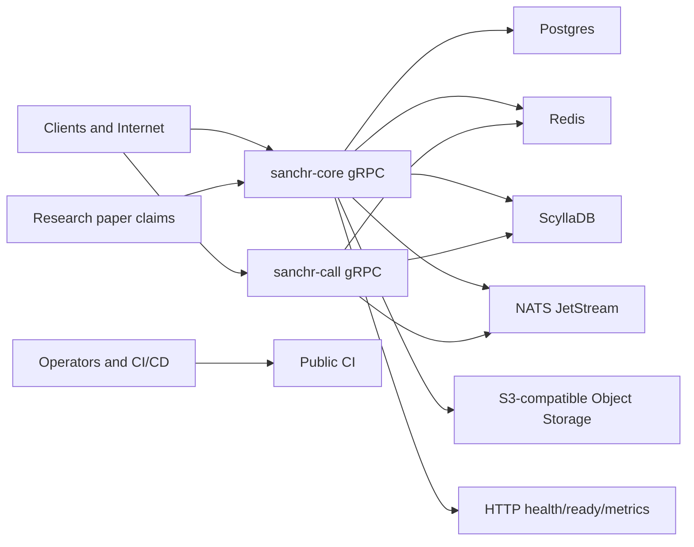

# Sanchr Backend Threat Model and Open Source Readiness

Date: 2026-04-11

Scope: `backend/**`, with `web/public/research.pdf` used as an input for security claims and expected properties.

## Executive summary

The backend is not ready to open source as-is. It is reasonable for private dev/testing, which matches the current deployment status, but a public release should wait until the release-blocking items below are addressed.

The highest-risk issues are:

1. Dev-mode authentication can bypass OTP with the static code `999999` when `auth.dev_mode` is enabled. This must be impossible outside isolated local/dev environments.
2. The product direction is OTP-based auth, but a legacy password-change endpoint still exists (`crates/sanchr-core/src/auth/handlers.rs:495`). That endpoint should be removed in a later auth cleanup rather than treated as the account recovery control.
3. Internal NATS is treated as trusted. Relay bridges forward NATS events to users, so a compromised internal producer can inject message and call events unless operators add auth/ACLs.
4. Several authenticated RPCs lack explicit per-request caps on repeated items or byte sizes, allowing storage/CPU amplification by ordinary accounts.
5. The research paper claims time-bounded privacy defenses, including OPRF discovery, ratchet-derived media keys, and EKF lifecycle enforcement. The repository contains partial or optional implementations: OPRF and EKF are not enabled by default, OPRF can run with an ephemeral dev secret, and sealed-sender signing uses an ephemeral dev key.
6. Basic open source policy files and secretless public CI are now present, but the code still uses legacy `sanchr` naming across crates, proto packages, Kubernetes objects, and binaries. The full rename remains a separate compatibility-sensitive project.

Recommended release posture:

- For open source, publish the sanitized source repository named and branded as `sanchr`, with production deployment/CD kept in a separate private operations repository.
- Do not make public claims that the paper defenses are production-enforced until startup gates, config defaults, rotation jobs, and tests demonstrate those properties.

## Scope and assumptions

In scope:

- Rust backend workspace in this repository.
- Runtime services: `sanchr-core`, `sanchr-call`, `sanchr-db`, `sanchr-proto`, `sanchr-psi`, `sanchr-server-crypto`, and `sanchr-common`.
- Backend source and public CI/CD files under `.github` and the Rust workspace.
- Open source readiness: naming, policies, license posture, private CD separation, repo metadata, and release hygiene.
- Research-paper alignment using `/Users/soorajpandey/Projects/zynclave/sanchr/web/public/research.pdf`.

Out of scope:

- Client-side iOS/Android/Web implementation.
- Production cloud account configuration not represented in the repo.
- Dynamic penetration testing against a running deployment.
- Cryptographic proof review of OPRF, Signal-style messaging, or EKF constructions beyond repository integration review.

Validated assumptions from the project owner:

- The backend is currently in dev/testing, not production.
- GitHub CD will remain in a private repository.
- The public project name should be `sanchr`, not `sanchr`.

Security posture assumptions:

- The public internet can reach gRPC ingress endpoints.
- Any authenticated account may be malicious.
- A compromised pod or internal service may be able to publish to NATS unless auth/ACLs are added.
- Database, Redis, Scylla, S3, and NATS credentials are high-value secrets.
- The research paper creates user-facing expectations that time-bounded privacy controls are implemented and enforced.

## System model

### Primary components

- `sanchr-core`: primary gRPC and HTTP process (`crates/sanchr-core/src/main.rs`). It exposes auth, keys, messaging, contacts, settings, vault, media, backup, notification, and discovery services. It also exposes `/health`, `/ready`, and `/metrics` over HTTP (`crates/sanchr-core/src/server.rs:45`).
- `sanchr-call`: call signaling service using JWT auth, Redis active-call state, Scylla call logs, and NATS call subjects (`crates/sanchr-call/src/signaling.rs`).
- `sanchr-db`: Postgres migrations and repository functions, Redis helpers, Scylla table creation and data access.
- `sanchr-proto`: public API surface. Proto packages still use `sanchr.*`, such as `sanchr.auth` and `sanchr.messaging`.
- `sanchr-psi`: OPRF/PSI helper code used for private discovery.
- `sanchr-server-crypto`: JWT, password hashing, OTP, media key, TURN credential, and sealed sender crypto helpers.
- Data stores: Postgres, Redis, ScyllaDB, NATS JetStream, and S3-compatible object storage.
- Public repository contents: Rust services, docker-compose for local dependencies, load tests, and GitHub Actions under `.github/workflows`.

### Data flows and trust boundaries

1. Client to `sanchr-core` gRPC:
   - Unauthenticated entry points: registration, login, OTP verification, and similar auth bootstrap operations.
   - Authenticated entry points: messages, keys, contacts, settings, media, vault, backup, notification, and discovery.
   - Trust boundary: internet/client input crosses into privileged backend state.

2. Client to `sanchr-call` gRPC:
   - Authenticated call initiation, signaling stream, call end, history, and TURN credential minting.
   - Trust boundary: real-time streaming client input crosses into Redis, Scylla, and NATS.

3. `sanchr-core` HTTP:
   - `/health`, `/ready`, and `/metrics` are unauthenticated routes in the Axum router.
   - Trust boundary: operational metadata may cross from private infra to callers depending on ingress exposure.

4. `sanchr-core` and `sanchr-call` to Postgres:
   - Stores accounts, devices, keys, contacts, settings, media metadata, backup metadata, and refresh token hashes.

5. Services to Redis:
   - Stores sessions, rate-limit counters, OTPs, presence, idempotency keys, pre-key counters, and delivery tokens.

6. Services to Scylla:
   - Stores message outbox, sealed outbox, receipts, pending messages, vault items, reactions, and call logs.

7. Services to NATS:
   - Transports call events and message relay events.
   - Broker authentication and ACLs are operator-managed and not enforced by this repository.

8. `sanchr-core` to S3-compatible storage:
   - Issues presigned upload/download URLs for media and backups.
   - Stores encrypted blobs while the server owns metadata and access decisions.

9. Private CI/CD to cloud infrastructure:
   - Production image publishing, production Helm values, cloud credentials, and cluster deploys belong in a private operations repository.
   - Public CI should remain limited to secretless build, lint, and test jobs.

#### Diagram

## Assets and security objectives

Primary assets:

- User identities, phone numbers, device identifiers, and account recovery material.
- Refresh tokens, access-token sessions, OTPs, JWT signing secret, and password hashes.
- Social graph data: contacts, contact discovery responses, registered-user membership, blocks, presence, and profile metadata.
- End-to-end encryption key material handled by the server in public form: identity keys, signed pre-keys, Kyber pre-keys, one-time pre-keys, sender certificates, delivery tokens, and relay metadata.
- Message metadata and encrypted message blobs in Scylla outboxes.
- Media, backup, and vault metadata plus encrypted blobs stored in object storage.
- NATS subjects and payloads for call and message relay.
- Operator-managed secrets: database URLs, Redis URL, NATS URL, S3 access keys, JWT/OTP/TURN secrets, and any cloud credentials kept outside this repo.
- Research credibility: paper claims around time-bounded state, OPRF contact discovery, ratchet-derived media keys, and EKF enforcement.
- Open source project integrity: package names, license terms, disclosure policy, public CI behavior, and contributor expectations.

Security objectives:

- Prevent account takeover through OTP bypass, weak session handling, or leaked persistent refresh tokens.
- Keep server-visible contact discovery and social graph exposure bounded and consistent with paper claims.
- Prevent malicious authenticated users from exhausting storage, CPU, NATS, Scylla, Postgres, Redis, or S3.
- Ensure internal event buses cannot be used as unauthenticated control planes.
- Keep encrypted media, vault, and backup metadata access scoped to the owner and retention windows.
- Ensure errors and logs do not leak secrets, OTPs, infrastructure internals, or user-private metadata.
- Make public source safe to inspect, fork, and run without exposing private deployment details or misrepresenting production security.

## Attacker model

### Capabilities

- Anonymous internet attacker can hit public auth and unauthenticated health/readiness endpoints.
- Authenticated malicious user can call all authenticated gRPC APIs and stream APIs at volume.
- Malicious registered user can upload many contacts, keys, device messages, sealed messages, backups, and media metadata.
- Network-adjacent attacker may observe endpoint availability and timing, subject to TLS termination security.
- Compromised application pod or internal workload can attempt to publish to NATS, connect to Redis, or call internal services if network policy allows it.
- Leaked refresh token holder can attempt indefinite session persistence.
- Public repo reader can inspect source, defaults, deployment patterns, hostnames, registry names, and project maturity signals.
- Contributor or fork maintainer can run local dev stacks using docker-compose and operator-provided config.

### Non-capabilities

- Cannot break standard cryptographic primitives such as Argon2, JWT HMAC under unknown secret, HMAC-based TURN credential generation, AES-GCM, or OPRF primitives by cryptanalysis.
- Cannot access private production GitHub secrets if production CD remains in a private repo.
- Cannot directly read database contents without a service compromise or credential leak.
- Cannot decrypt correctly end-to-end encrypted message, vault, backup, or media payloads without client-held keys.
- Cannot bypass Kubernetes network policy, NATS ACLs, or cloud IAM controls if operators deploy those controls correctly.

## Entry points and attack surfaces

| Surface | Representative files | Auth boundary | Main risks |
| --- | --- | --- | --- |
| Auth registration/login/OTP | `crates/sanchr-core/src/auth/handlers.rs` | Mixed unauth/auth | OTP bypass in dev mode, OTP logging, account enumeration, persistent token theft |
| Refresh/session lifecycle | `crates/sanchr-db/src/postgres/refresh_tokens.rs`, `crates/sanchr-db/src/redis/sessions.rs` | Token based | Permanent refresh tokens not revoked on password change |
| Message sending | `crates/sanchr-core/src/messaging/handlers.rs` | JWT and Redis session | Unbounded device message arrays, byte-size amplification, TTL overflow |
| Sealed sender | `crates/sanchr-core/src/messaging/sealed_handler.rs`, `crates/sanchr-db/src/redis/delivery_tokens.rs` | Anonymous one-time delivery token | Token misuse, unbounded fanout, ephemeral signing key |
| Call signaling | `crates/sanchr-call/src/signaling.rs` | JWT and Redis session | NATS subject injection, unbounded stream messages, unbounded call-history limit |
| Contact sync | `crates/sanchr-core/src/contacts/handlers.rs` | JWT and Redis session | Social graph leakage via hash matching and phone-number return |
| Discovery/OPRF | `crates/sanchr-core/src/discovery/handlers.rs`, `crates/sanchr-core/src/discovery/service.rs` | JWT and Redis session | Registered-set enumeration, paper-claim mismatch, weak lifecycle if EKF disabled |
| Key upload/retrieval | `crates/sanchr-core/src/keys/handlers.rs` | JWT and Redis session | Unbounded one-time pre-key upload and public key byte lengths |
| Media | `crates/sanchr-core/src/media/handlers.rs` | JWT and Redis session | S3 object abuse, presigned URL leakage, raw error leakage |
| Backup | `crates/sanchr-core/src/backup/handlers.rs` | JWT and Redis session | Large backup storage, uncapped metadata, list without pagination |
| Vault | `crates/sanchr-core/src/vault/handlers.rs`, `crates/sanchr-db/src/scylla/mod.rs` | JWT and Redis session | Lifecycle enforcement, startup table drops in dev/staging code path |
| HTTP ops routes | `crates/sanchr-core/src/server.rs` | None in router | Metrics/readiness info exposure |
| NATS | Relay bridge files and operator-managed broker config | Internal network trust | Unauthenticated event injection if reachable |
| CI/CD | `.github/workflows/*.yml` | GitHub-hosted secretless CI | Public CI drift or accidental coupling to private ops assumptions |
| Config/env | `.env.example`, optional `config/*.yaml`, operator environment | Operator controlled | Misconfigured dev mode, placeholder secrets, inconsistent local setup |

## Top abuse paths

1. Dev-mode OTP takeover
   - Path: attacker registers or verifies an account using static OTP `999999` when `auth.dev_mode` is true.
   - Impact: account takeover, fake account creation, bypassed phone verification.
   - Mitigations: default `dev_mode=false`, require explicit local-only enablement for dev mode, fail startup when placeholder secrets or dev mode are used outside local, remove OTP logs from non-dev.

2. Legacy password-change endpoint conflicts with OTP-based auth
   - Path: clients or operators treat the password-change endpoint as an account recovery control even though the product direction is OTP-based auth.
   - Impact: confusing recovery semantics and stale password-based surface area in an OTP-first product.
   - Mitigations: remove the password-change API in a dedicated auth cleanup; define OTP-based recovery/session revocation semantics; expose active-session/device management for account safety.

3. NATS event injection from an internal foothold
   - Path: compromised pod or misconfigured internal client publishes to `msg.relay.*`, `msg.sealed.*`, or `call.*` subjects. Relay bridges forward payloads to connected users.
   - Impact: forged call events, forged relay events, phishing UX, message-delivery confusion, denial of service.
   - Mitigations: enable NATS authentication, TLS, subject ACLs, and Kubernetes network policy; restrict publish/subscribe by service account; sign or authenticate relay envelopes at application layer.

4. Authenticated storage/CPU amplification
   - Path: a valid account sends large arrays or byte fields to message, sealed-message, key-upload, backup metadata, call signaling, or call-history APIs that lack explicit caps.
   - Impact: Scylla/Postgres/S3 growth, memory pressure, gRPC worker exhaustion, queue pressure, elevated cloud cost.
   - Mitigations: set Tonic max inbound/outbound sizes, per-RPC schema caps, per-user quotas, per-device fanout limits, max history page size, and request-level rate limits.

5. Paper privacy claim mismatch
   - Path: public users or auditors compare the paper's OPRF/EKF/time-bounded claims to code paths where OPRF/EKF are optional or dev-mode ephemeral.
   - Impact: trust loss, inaccurate security claims, privacy guarantees not enforced by default.
   - Mitigations: create production startup preflight for OPRF, EKF, sealed-sender signer, retention workers, and key rotation; document which defenses are enabled in dev; add integration tests for TTL and rotation properties.

6. Contact discovery enumeration
   - Path: malicious user repeatedly invokes legacy hash-based contact sync, registered-set discovery, or Bloom filter retrieval to learn membership and social graph edges.
   - Impact: phone-number registration enumeration, social graph leakage, privacy regression against paper goals.
   - Mitigations: make legacy contact sync dev-only or remove it before public claims; tune per-user and per-phone rate limits; monitor discovery queries; avoid returning raw phone numbers where not strictly needed; gate registered-set APIs.

7. Media, backup, and vault retention drift
   - Path: encrypted blobs or metadata outlive expected lifetimes because retention depends on storage lifecycle policies or optional EKF loops not enforced at startup.
   - Impact: server-side metadata and encrypted auxiliary state persist beyond paper-defined windows.
   - Mitigations: enforce S3 lifecycle policies, run cleanup workers, add retention integration tests, and fail startup when required lifecycle enforcement is disabled in non-dev.

8. Public repository leaks operational assumptions
   - Path: public readers see production registry names, cluster names, real hosts, object-storage buckets, or deployment workflows if private ops material is reintroduced.
   - Impact: unnecessary recon data, accidental production deployment from public Actions, brand confusion.
   - Mitigations: keep deployment workflow and production values in the private ops repo; keep public CI secretless; do not reintroduce deploy manifests or production config into this repository.

9. Incomplete rename to Sanchr
   - Path: public repo still exposes `sanchr` in crate names, proto packages, Kubernetes names, Docker image names, docs, and metrics.
   - Impact: brand confusion, API churn after public launch, stale package names embedded in generated clients.
   - Mitigations: decide whether to do a breaking rename before public release; rename crates/images/resources to `sanchr-*`; consider proto package migration carefully because generated client compatibility may break.

10. Error and log data leakage
    - Path: many handlers return `Status::internal(format!("... {e}"))`; dev OTP logs include OTP values when dev mode is true.
    - Impact: clients may receive infrastructure details, logs may contain authentication material.
    - Mitigations: centralize gRPC error mapping, return generic client errors, preserve detailed server-side logs with redaction, disable OTP logging except in explicit local-only mode.

## Threat model table

| ID | Threat | Evidence | Impact | Existing controls | Gaps | Mitigation | Priority |
| --- | --- | --- | --- | --- | --- | --- | --- |
| TM-001 | Dev-mode OTP bypass reaches shared environment | `auth.dev_mode` accepts static OTP in `crates/sanchr-core/src/auth/handlers.rs`; operator misconfiguration could enable it outside local/dev | Account takeover and fake account creation | Phone-based rate limits on register/login/verify | Dev OTP path still exists in code; depends on operator discipline and startup guards | Default dev mode off; startup fail-closed outside local; scrub OTP logs; document local-only use | P0 before public/prod |
| TM-002 | Legacy password-change endpoint conflicts with OTP-based auth | Password-change logic still exists in `crates/sanchr-core/src/auth/handlers.rs:495`, while the product direction is OTP-based auth | Confusing recovery semantics and stale password-based surface area | OTP registration and login flows exist; refresh tokens are hashed and rotated | Password-change API remains exposed; OTP-based recovery/session revocation semantics are not documented here | Remove the password-change API in a dedicated auth cleanup; define account recovery and session revocation semantics; add active device management | P1 follow-up auth cleanup |
| TM-003 | NATS injection from compromised internal workload | Relay bridges subscribe to wildcard subjects and forward payloads; broker auth/ACLs are operator-managed and not enforced by this repo | Forged events, user confusion, DoS | NATS is intended to be internal; call stream validates users before normal publish | Internal network is trusted too broadly unless operators add auth/ACLs | NATS TLS/auth/ACLs; network policy; per-service subject permissions; signed relay envelopes | P0 before prod, P1 before open source |
| TM-004 | Authenticated payload amplification | Message, sealed-message, key-upload, backup metadata, call stream, and call-history paths lack consistent caps; examples include `crates/sanchr-core/src/messaging/handlers.rs`, `crates/sanchr-core/src/messaging/sealed_handler.rs`, `crates/sanchr-core/src/keys/handlers.rs`, and `crates/sanchr-call/src/signaling.rs:486` | Storage, CPU, memory, queue, and cloud-cost DoS | Some caps exist: media 100 MiB, backup body 512 MiB, vault metadata 64 KiB, discovery batch 500 | Missing global gRPC size limits, array limits, and byte limits | Add per-RPC constants, Tonic max message sizes, quotas, paging maxes, fuzz/load tests | P1 |
| TM-005 | Paper-claim mismatch for OPRF/EKF/time bounds | Main generates ephemeral OPRF secret if config is absent and warns dev-only; EKF loop only runs if enabled in config; sealed-sender signer is generated at startup | Public security claims may be inaccurate; privacy windows may not hold | Code has OPRF, EKF, vault, and media-key concepts | Defaults do not enforce claimed production posture; HSM/weekly rotation not present in repo | Add production preflight, KMS/HSM-backed OPRF and signer keys, rotation jobs, and claim-specific tests | P1 before public paper-aligned release |
| TM-006 | Contact discovery membership and social graph leakage | Legacy contact sync matches `phone_hashes` and returns `phone_number` in `crates/sanchr-core/src/contacts/handlers.rs:15`; registered set and Bloom filter are available to authenticated users in discovery handlers | Phone-number registration enumeration and social graph leakage | Per-user contact sync and discovery rate limits; OPRF batch limit | Legacy hash sync conflicts with OPRF privacy story; registered-set endpoint exposes set material | Gate/remove legacy sync; reduce returned identifiers; tune rate limits; alert on discovery abuse | P1 |
| TM-007 | Media/backup/vault lifecycle drift | Research paper expects time-bounded auxiliary state; object lifecycle and EKF enforcement are not fail-closed; Scylla startup drops vault tables for dev/staging in `crates/sanchr-db/src/scylla/mod.rs:110` | Data retained too long or accidentally dropped in wrong environment | Ownership checks on media/vault/backup; vault metadata size cap | Retention is not proven by startup gates or tests; dev table drops must not reach prod | Storage lifecycle policies, cleanup workers, fail-closed env checks, remove startup drops before public/prod | P1 |
| TM-008 | Public repo exposes private operations shape | Public source should not contain production deploy workflows, real registry names, cluster names, hosts, or object-storage buckets | Recon data and accidental deploy behavior in public repo | Public CI is secretless; production CD is intended to stay private | Private ops material can regress back into the public repo without review gates | Keep deploy workflow and production values in private ops; scan public source for private infra strings; pin actions by SHA | P1 guardrail |
| TM-009 | Naming drift from `sanchr` to `sanchr` | Workspace crates, proto packages, Docker images, Helm resources, docs, and registry names still use `sanchr`; user wants `sanchr` | Brand/API churn and generated-client breakage after public release | Some dashboards and hosts already use Sanchr | Rename is not complete; proto package rename is breaking | Perform planned rename before public launch; document compatibility if proto packages stay stable | P2 |
| TM-010 | Open source policy process must be operational | `LICENSE`, `SECURITY.md`, `CONTRIBUTING.md`, `CODE_OF_CONDUCT.md`, and README now define baseline public policy | Clearer rights, reporting process, and contribution expectations | MIT license and policy docs are present | Security mailbox and maintainer response process must be confirmed before public launch; dependency license/advisory policy is still pending | Verify security contact monitoring; add `cargo audit`/`cargo deny` or equivalent; add SBOM/release checklist | P2 |
| TM-011 | Operational metadata exposed over HTTP | Router exposes `/health`, `/ready`, `/metrics` without auth in `crates/sanchr-core/src/server.rs:45`; readiness probes test dependencies | Dependency and metrics exposure if ingress routes are too broad | Separate health ingress template appears limited | Router itself has no auth; metrics exposure depends on deployment | Keep `/metrics` internal; restrict `/ready`; use NetworkPolicy/ingress auth; redact readiness error detail | P2 |
| TM-012 | Raw internal errors returned to clients | Many handlers construct `Status::internal(format!("... {e}"))` with DB/S3/Redis/NATS errors | Infrastructure details leak to clients and logs | Some code uses generic permission-denied semantics for ownership misses | No centralized gRPC error sanitization | Map internal errors centrally; return stable public error codes; keep detailed logs server-side | P2 |

## Criticality calibration

Priority definitions:

- P0: blocks production or public launch. Exploitable for account takeover, persistent compromise, or serious infrastructure abuse.
- P1: should be fixed before open source or any non-local shared deployment. Exploitable by authenticated users or internal footholds, or materially affects public security claims.
- P2: important hardening and open source readiness work. Not necessarily immediately exploitable in dev, but creates avoidable release risk.
- P3: cleanup or documentation improvement.

Current project calibration:

- Because the project is in dev/testing, immediate external user impact is lower than it would be in production.
- Because the repository may become public, issues that expose confusing defaults, private ops details, or inaccurate paper-aligned claims remain high priority even if no production users exist.
- Dev-only table drops and dev-mode OTP behavior can be acceptable only when mechanically constrained to local/dev and impossible to carry into staging or production by accident.
- The private CD clarification lowers the risk of `.github/workflows/deploy.yml` only if the public repo does not include that workflow.

Release blockers for open source:

1. Keep production deploy workflow and production/cloud-specific identifiers out of the public repository.
2. Complete or explicitly plan the remaining legacy `sanchr` naming cleanup.
3. Confirm the security contact and maintainer response process are operational.
4. Make dev-mode auth fail-closed outside local/dev.
5. Document which research-paper defenses are implemented, disabled, experimental, or pending.

Release blockers for production:

1. Disable dev-mode OTP bypass and dev secrets.
2. Remove the legacy password-change endpoint and define OTP-based account recovery/session revocation semantics.
3. Add NATS authentication, ACLs, TLS, and network policy.
4. Add request size, item count, rate, and quota limits across all high-fanout RPCs.
5. Enforce OPRF/EKF/sealed-sender key material and lifecycle preflights for paper-aligned deployment.
6. Remove startup table drops and prove retention/deletion behavior with tests.

## Focus paths for security review

1. Auth and session lifecycle
   - Review `crates/sanchr-core/src/auth/handlers.rs`, `crates/sanchr-db/src/postgres/refresh_tokens.rs`, `crates/sanchr-db/src/redis/sessions.rs`, and JWT/OTP helpers.
   - Remove the password-change endpoint in a dedicated auth cleanup because the product direction is OTP-based auth.
   - Add tests for OTP-based recovery and session revocation semantics once defined.
   - Add tests that dev OTP is rejected when environment is not local/dev.

2. Deployment fail-closed configuration
   - Review `.env.example`, optional `config/*.yaml` support, and `.github/workflows`.
   - Add a config validator that rejects placeholder secrets, dev mode, ephemeral OPRF secrets, and ephemeral sealed-sender signer in non-dev.
   - Keep public CI secretless and free of private deployment assumptions.

3. NATS and internal event trust
   - Review `crates/sanchr-core/src/messaging/relay_bridge.rs`, `crates/sanchr-call/src/signaling.rs`, and NATS publishing/subscription subjects.
   - Add subject ACLs, per-service credentials, network policy, and application-level relay-envelope authenticity checks in operator-managed deployments.

4. Payload bounds and quota enforcement
   - Review `messaging`, `sealed_handler`, `keys`, `backup`, and `calling` handlers.
   - Define constants for max device messages, ciphertext bytes, key counts, metadata bytes, stream message bytes, and max page sizes.
   - Enforce limits at protobuf validation and Tonic transport boundaries.

5. Contact discovery and paper alignment
   - Review `contacts`, `discovery`, `ekf`, `media_keys`, `vault`, and `backup` code paths against the research paper.
   - Decide whether legacy hash contact sync remains in public code. If yes, document it as a dev/testing or compatibility API and keep it outside paper-backed claims.
   - Add tests for daily salt rotation, OPRF secret configuration, EKF TTLs, media auxiliary-state expiry, and backup/vault retention.

6. Open source release hygiene
   - Rename or intentionally freeze `sanchr` identifiers before public release.
   - Keep `LICENSE`, `README.md`, `SECURITY.md`, `CONTRIBUTING.md`, and `CODE_OF_CONDUCT.md` current; add `NOTICE` if dependency/license review requires it.
   - Add dependency policy: `cargo audit` or equivalent advisory scanning, dependency license checks, SBOM generation, and pinned GitHub Actions.
   - Keep private deployment docs, production values, registry names, and secrets in a private ops repository.

## Quality check

- Repository-grounded: findings cite concrete files and behaviors observed in the backend repository.
- Assumptions validated: current environment is dev/testing, production CD will be private, and the intended public name is `sanchr`.
- Paper-aware: the model incorporates claims from `web/public/research.pdf` and flags gaps where repository defaults do not enforce those claims.
- Abuse-path focused: top risks are written as attacker paths with impact and mitigations, not generic STRIDE categories.
- Open-source focused: the report includes naming, license, policy, CI/CD, and public-claim readiness, not only runtime threats.
- No secrets disclosed: local `.env` values were not copied into this report.
- Limitations: this is a static repository review. It does not prove exploitability dynamically, validate live Kubernetes/IAM/NATS settings, or audit client applications.
